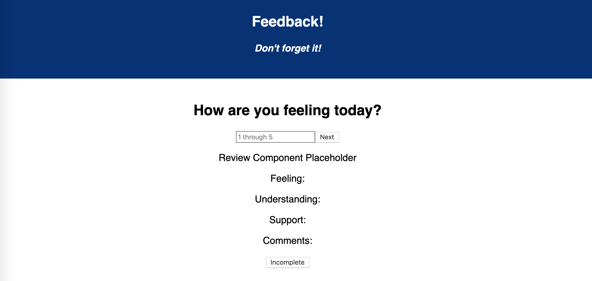
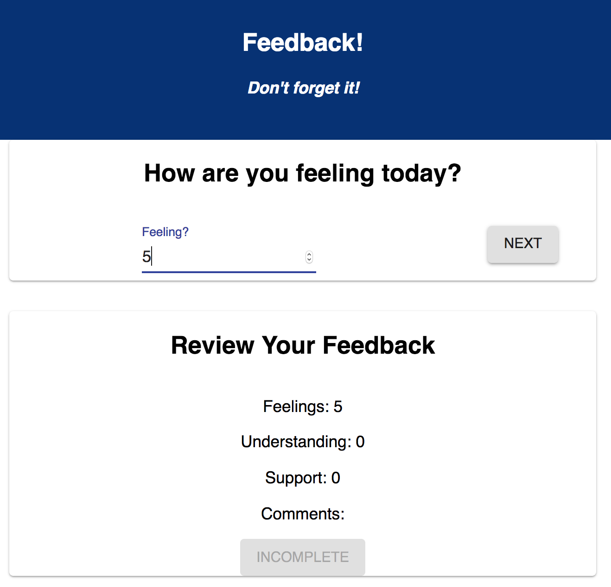

# Redux Feedback Loop

This is a single page application that mimmics the Daily Feedback form used at Prime Academy.  Rate your overall Feeling, your Understanding of the material, how well you're feeling Support from the staff, and leave any Comments you have.  Your answers will be displayed below the form questions.  When the survey is complete, the option to "Submit" will appear and you may send in the information.  Once submitted, a Thank You page appears with the option to retake the survey.

### Built With

Code edited with VS Code using React.
Node.js with Postgress and Express.
React Redux
React Router
Database built on Postico.

### Setup

Fork and Clone from the GitHub Repository.  

All database setup information is located in the database.sql file. Open Postico and execute the database.sql statements.   

Running the server code requires `nodemon`. If you don't already have `nodemon`, install it globally with `npm install nodemon --global`.

```
npm install
npm run server
```

Now that the server is running, open a new terminal tab with `cmd + t` and start the react client app.

```
npm run client
```

Between the server and client, you'll need two terminal tabs. Because we're using `nodemon`, both our client side and server side will automatically spin back up when changes are made.


### Screen Shot




### Completed Features
- [x] Server information will save into the database
- [x] Single page application that reveals different components using Hash Router
- [x] Success Page brings user back to start and clears out information on the DOM


### Next Steps
- [x] Prepare project for deployment

### Authors
Pete St. Martin

### Acknowledgements
Dane Smith
Chris Black
Luke Schlangen
Kris Szafranski

# Original Assignment Instructions

# Redux Feedback Loop


>Do not clone this repository. Instead, download the zip, extract the contents, create a new GitHub repository and `git init`, `git add .`, `git commit -m "initial commit - base project"` and add your remote. Please do this before you leave for the day.

**PLEASE COMMENT YOUR CODE.**

"And my last reminder of the day, which is my last reminder of every day, is...?" - Luke

 For this assignment, you will be creating a feedback form modeled after Prime's system. Feedback will be collected over 4 views, and when all steps are complete, your app will save the feedback in the database. In a separate part of the page, display the current feedback values and a submit button. 

### SETUP

Create your database and tables using the provided `data.sql` file. Start the server.

```
npm install
npm run server
```

Now that the server is running, open a new terminal tab with `cmd + t` and start the react client app.

```
npm run client
```

### ADD NEW FEEDBACK

> NOTE: As a baseline requirement, you must use Redux to store your data across views.

Create a multi-part form that allows users to leave feedback for today. 
There will be 4 views for the form parts.
The parts:
- How are you feeling today?

- How well are you understanding the content?

- How well are you being supported?

- Any comments you want to leave?


While there is no nav bar, each part of the form should be at its own route. Clicking next should move the user to the appropriate step in the process as well as update the `Review` Component.


## THE REVIEW COMPONENT

In addition to the multi-step form, the app needs to display the results of each step clearly and at all times. HINT: This will be your current redux values displayed on the DOM. 

The simplest way could be another component on the DOM which shows the results of the current survey and a Submit button.

### Incomplete, Submit button is disabled:


### Survey complete, Submit button is active:


## SUBMIT THE FEEDBACK

The `Review` portion needs a submit button which will be clicked on to actually submit the completed feedback to the server. **This submit button should only be active when all of the survey steps are complete.**

When the submit button is clicked, save the submission in the database. The user should see a submission success page.


## STRETCH GOALS

> NOTE: These stretch goals are intended to be completed in order.

### ADMIN SECTION

Display all of the existing feedback at the route `/admin`. The most recently added feedback should appear at the top of the list. Allow the user to delete existing feedback. Prompt the user to confirm prior to deleting the feedback from the database.


### OTHER FEATURES

- Update this README.md to describe the project in your own words
- Improve the styling of the app using Material-UI theme, cards, snackbars, buttons, nav bar, and icons, and anything else you'd like.
- Add the ability to flag an existing feedback entry for further review on the /admin view
- Deploy your project to Heroku -- you'll need to read the special instructions for building and deploying with these apps! 


